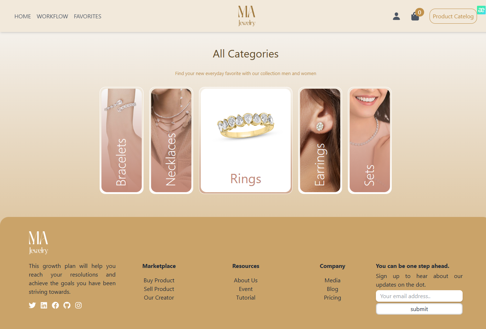
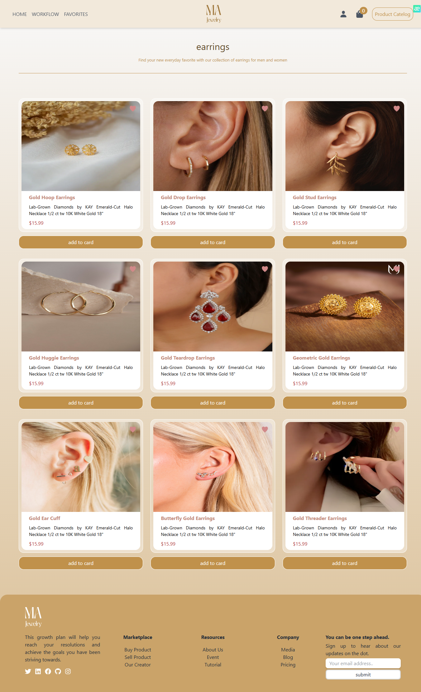
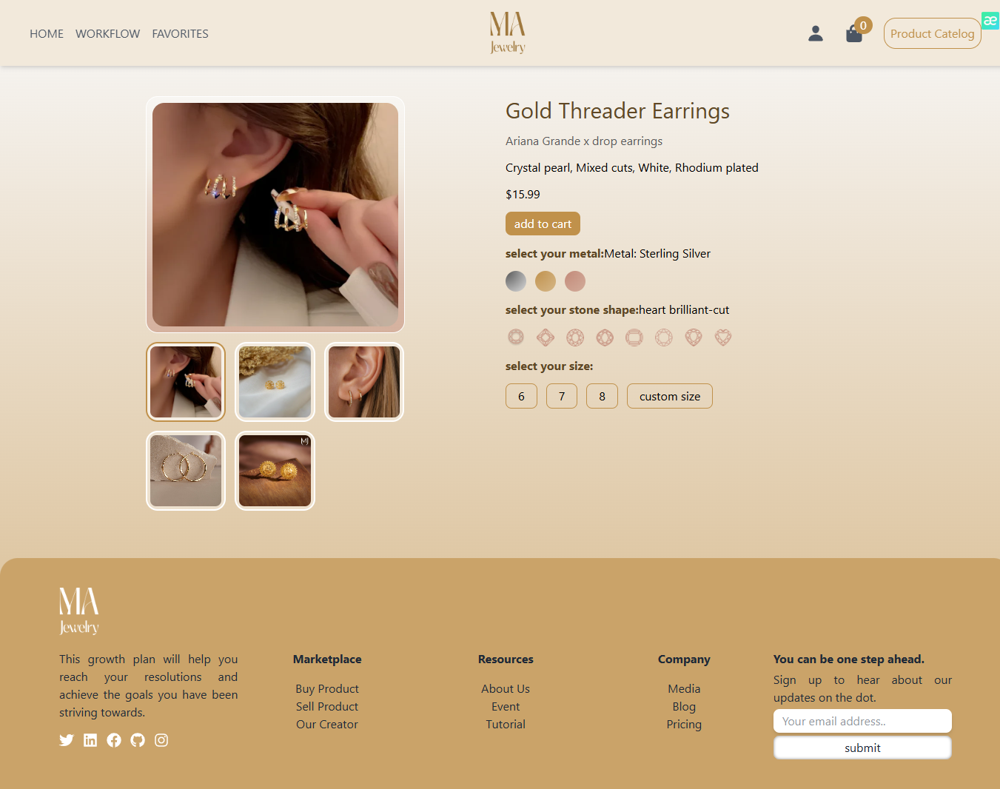
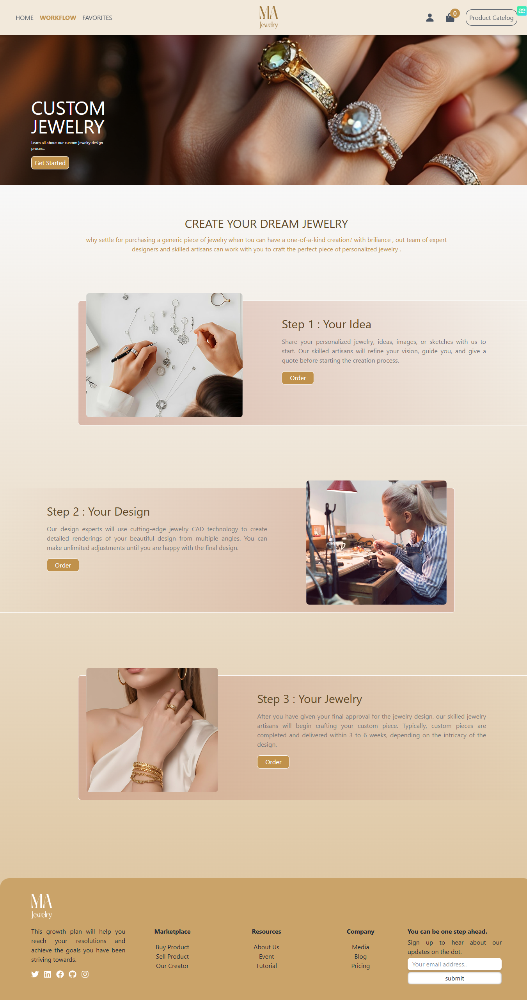

# 💎 Gold Website

An elegant and responsive **e-commerce platform** built with **React** and **TailwindCSS**, demonstrating dynamic product listing, shopping cart logic, and a clean user experience.

---

## 🔗 Live Demo

🌐 [Click here to view the live project](https://gold-website-tau.vercel.app)

---

## 📸 Screenshots

Here are some key pages of the application:

### 🏠 Home Page  
Landing page of the website.


---

### 🛍 Product Page  
Displays all product categories using nested routes and `<Outlet />`.



---

### 📂 Category Page  
Dynamic route example: `/products/necklaces`  
Displays all items in the selected category.



---

### 🔍 Product Detail Page  
Nested route: `/products/necklaces/:id`  
Shows individual product info and favorite button.



---

### 🔧 Workflow Page  
Describes the custom ordering process with modal and formik form.



## 🎯 Project Goals

This project was created to:

- Practice building a full-scale SPA (Single Page Application) with modern tools
- Learn how to structure large React apps with routing and state management
- Work with local JSON data and simulate real-world fetching scenarios
- Create a dynamic UI with reusable components and user interactions
- Explore context, reducer, and form handling in React

---

## 🛍️ Features Overview

### 🧭 Pages

- **Home** – Landing page with brief intro
- **Products** – All products displayed by category
- **Favorites** – List of user-favorited items
- **Workflow** – Steps and process of placing an order

### 📁 Routing

- Built using **React Router v6**
- Nested routing and `<Outlet />` for category-based layouts
- Dynamic routes:
- /products/:category
- /products/:category/:id
### 📦 Product Details

- Local JSON file used as the product database
- Data fetched using **Axios** + **React Query**
- Products are categorized and displayed via dynamic URL paths
- Clicking a product shows detailed info via its ID

### ❤️ Favorites System

- Click the heart icon to add/remove from favorites
- **React Toastify** used to display success notifications
- Favorite items are stored in component state
- Colored icon indicates favorited state
- Favorites can be removed directly from the favorites page

### 🛒 Shopping Cart

- Built using **React Context** + `useReducer`
- Handles:
- Add to cart
- Remove from cart
- Quantity increase/decrease
- Cart UI built with **Flowbite React**
- Cart logic shared across components using `dispatch`

### 🧾 Order Modal

- Modal opens upon clicking “Order”
- Form built with **Formik**
- Form validation and input handling implemented
- Simulates an order placement process

---

## 🧠 What I Learned

- Nested routing and dynamic paths using React Router v6
- Centralized state management with Context + Reducer
- Modularizing components and managing reusable logic
- Using Toast for better UX feedback
- Integrating Formik for form state/validation
- Structuring a full React project in a clean, scalable way

---

## 📈 Result / Outcome

This project reflects my ability to:

- Build a multi-page, dynamic SPA from scratch
- Create interactive UIs with real-world use cases (cart, favorites, modals)
- Handle state cleanly across components
- Improve responsiveness and accessibility using TailwindCSS
- Simulate realistic e-commerce behavior without a backend

---

## 💻 Tech Stack

- **React**
- **TailwindCSS**
- **React Router v6**
- **React Query**
- **Axios**
- **Formik**
- **React Toastify**
- **Flowbite React**
- **Context + Reducer**

---

## 🧰 How to Use / Run Locally

1. Clone the repository:

```bash
git clone https://github.com/Mahlagha2211/goldWebsite.git
cd goldWebsite
npm install
npm run dev
